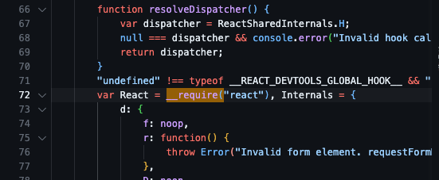
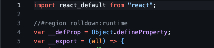

# rolldown-commonjs-resolution-issue

```console
[PREFER_BUILTIN_FEATURE] Warning: The functionality provided by `@rollup/plugin-commonjs` is already covered natively, maybe you could remove the plugin from your configuration
  │ 
  │ Help: This diagnostic may be false positive, you could turn it off via `checks.preferBuiltinFeature`
```

`rolldown` is supposed to support `@rollup/plugin-commonjs` out of the box but we have a different behavior betwen with and without the plugin

Tested with `@rollup/plugin-commonjs@17.1.0`

## Base Configuration

```json
{
  "input": "src/react-dom.js",
  "output": {
    "format": "esm",
    "exports": "named",
  },
  "external": ["react"]
}
```

## ❌ [default](./dist/default/react-dom.js)

```json
{
  "input": "src/react-dom.js",
  "output": {
    "format": "esm",
    "dir": "dist/default",
    "exports": "named",
  },
  "external": ["react"],
  "plugins": []
}
```

`React` is dynamically loaded using a `__require` helper.



## ✅ [plugin-commonjs](./dist/default/react-dom.js)

```json
{
  "input": "src/react-dom.js",
  "output": {
    "format": "esm",
    "dir": "dist/plugin-commonjs",
    "exports": "named",
  },
  "external": ["react"],
  "plugins": [commonjs()]
}
```

`React` is statically loaded with an esm import.



### How to reproduce it ?

run `node --run build` and compare `dist/default/react-dom.js` with `dist/plugin-commonjs/react-dom.js`.